# Windows Server 2022 Setup & Promotion to Domain Controller

**Host:** `fna-srv-dc01` (static IP `10.0.0.21`)  
**Domain:** `fna.test` (new forest)  
**Goal:** Build a Windows Server 2022 VM and promote it to the first Domain Controller (AD DS + DNS) for the `fna.test` lab domain.

## Prerequisites

- Windows Server 2022 VM installed and patched  
- **Static IP** configured (`10.0.0.21`) and **Preferred DNS** set to itself (`10.0.0.21`)  
- Local Administrator access

## Steps

### 1) Add AD DS role (Server Manager)

1. **Add roles and features** → **Role-based or feature-based installation**  
   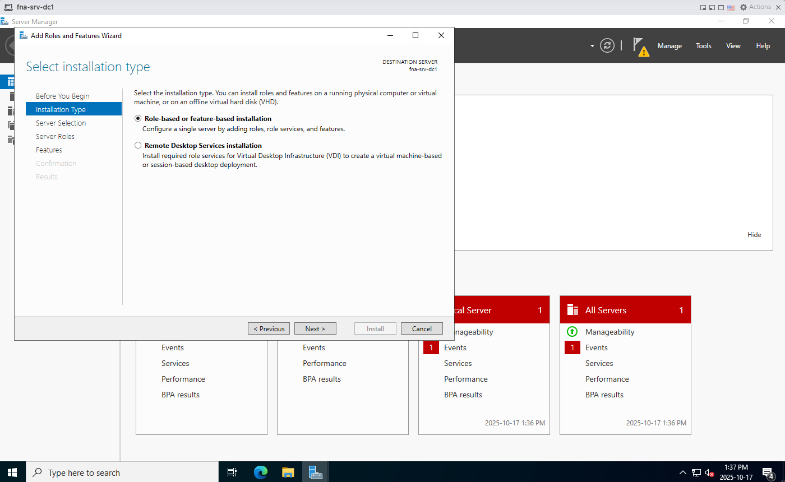

2. **Server Selection:** choose `fna-srv-dc01 (10.0.0.21)`  
   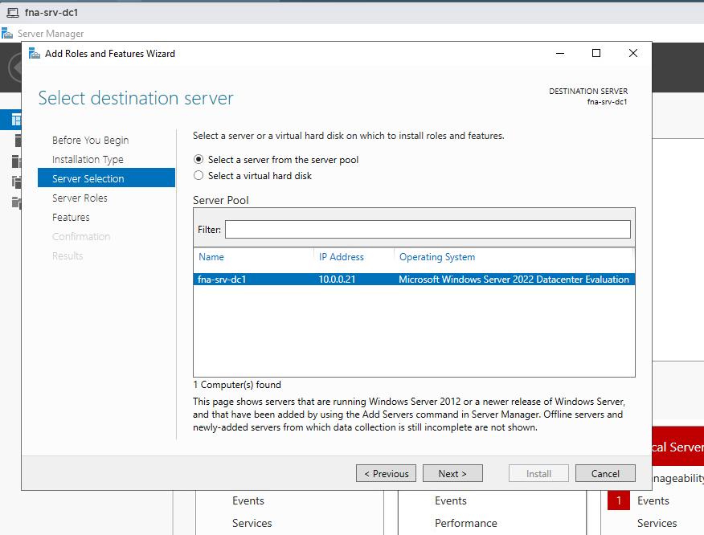

3. **Server Roles:** check **Active Directory Domain Services** (AD DS)  
   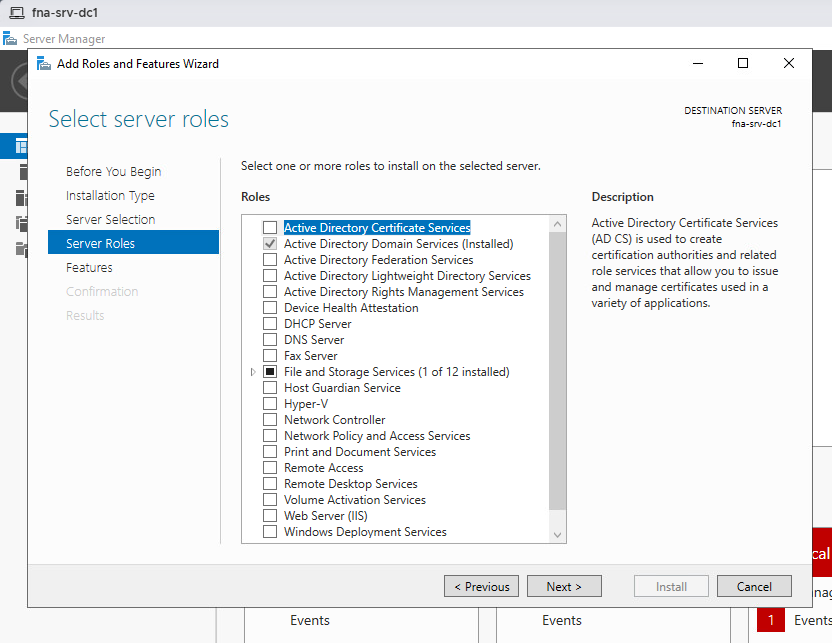

4. **Features:** confirm defaults (GPMC is included with AD DS)  
   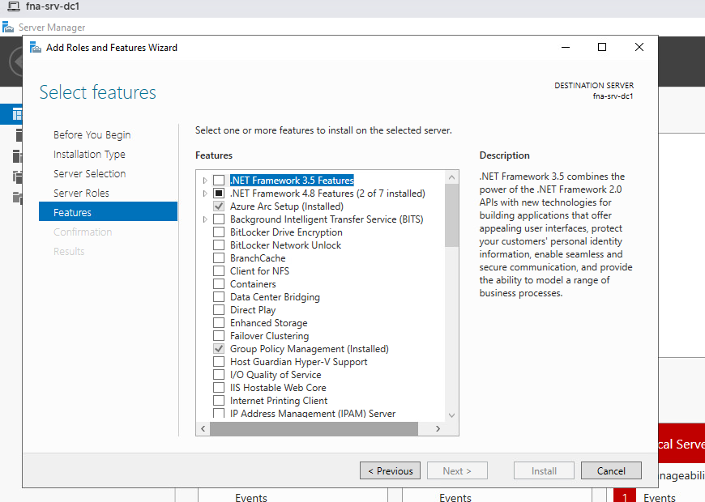

5. Click **Install**. When it finishes, use the yellow banner to **Promote this server to a domain controller**.  
   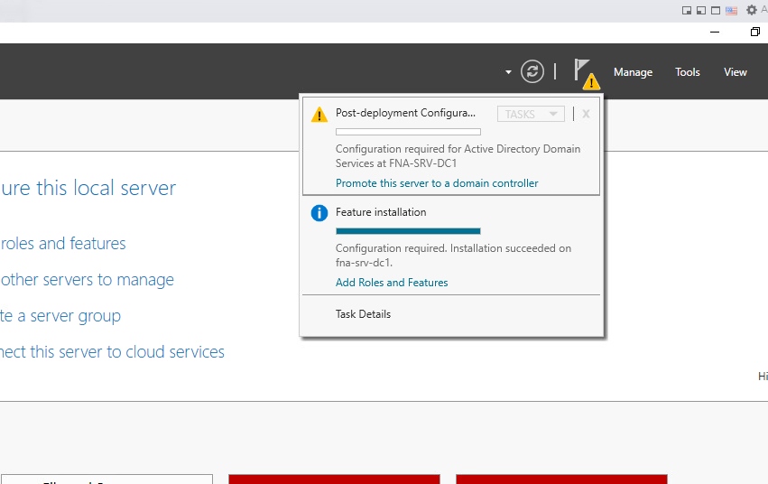

### 2) Promote to first DC (new forest)

6. **Deployment Configuration:** **Add a new forest** → Root domain name: `fna.test`  
   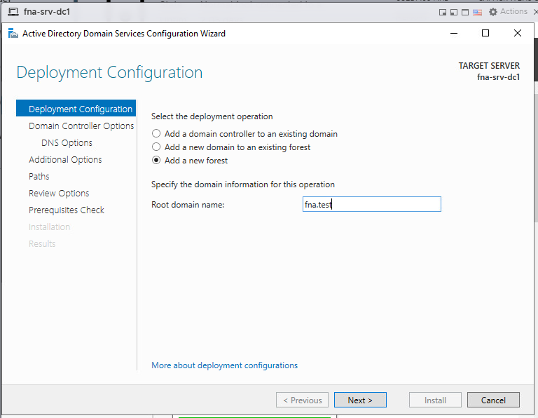

7. **Domain Controller Options:** leave **DNS** and **Global Catalog** checked. Set a **DSRM password**.  
   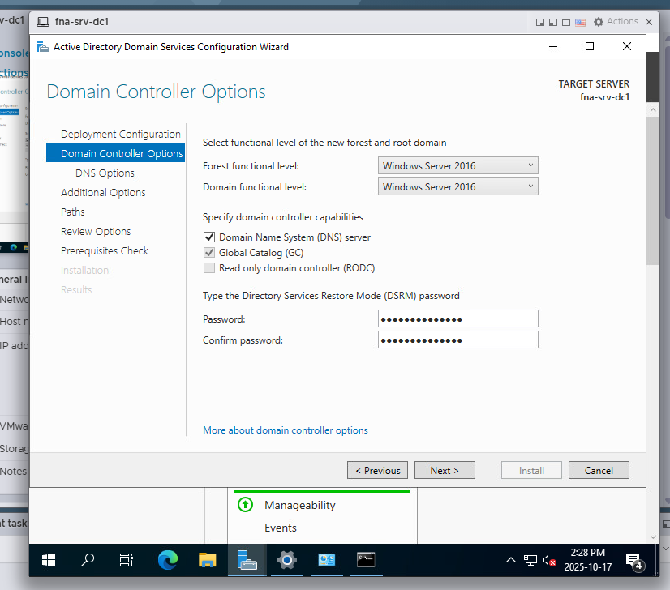

8. **DNS Options:** delegation warning is expected (no parent zone yet). Continue.  
   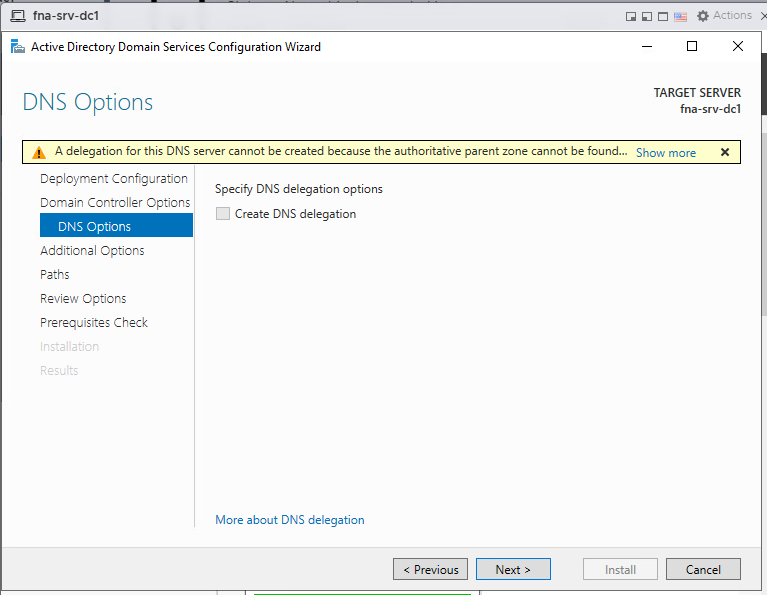

9. **Paths:** leave defaults for **NTDS** and **SYSVOL**.  
   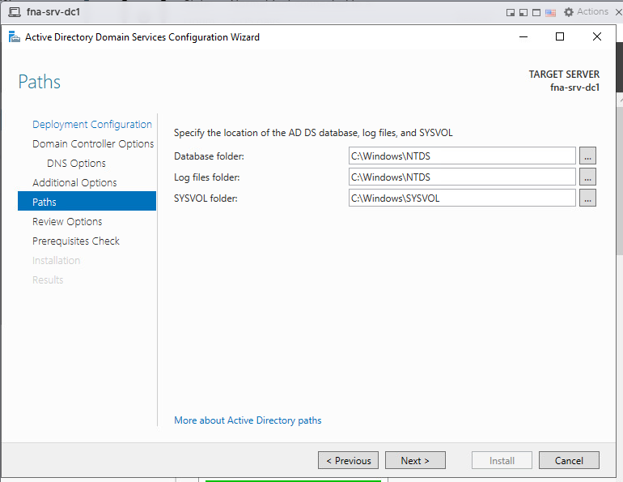

10. **Review Options:** confirm selections.  
    

11. **Prerequisites Check:** all checks pass (yellow triangles are informational).  
    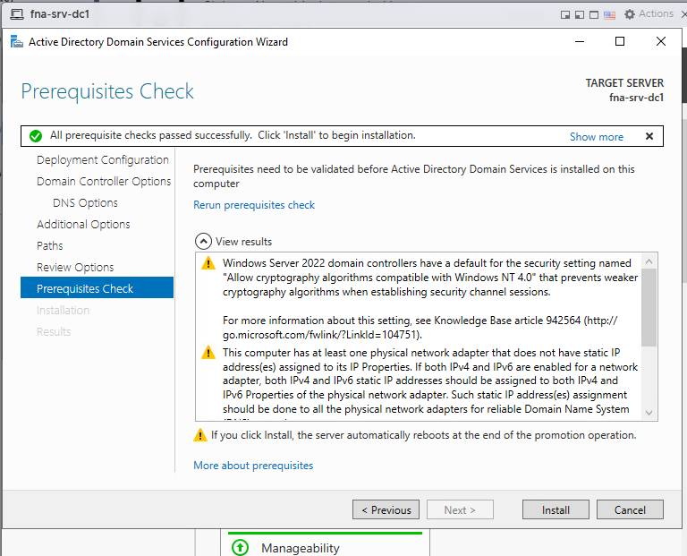

12. Click **Install**. The server will reboot automatically after promotion.  
    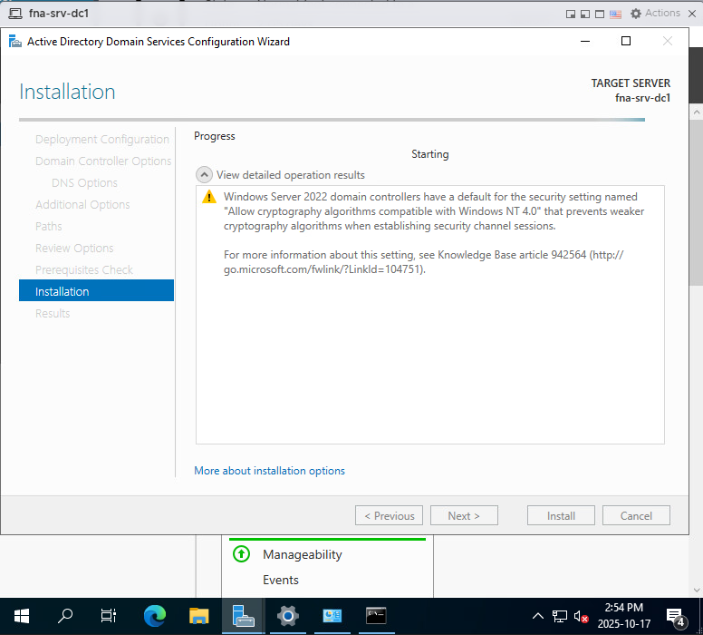

## Validation

- At the login screen, you should now see the **domain context** `FNA\Administrator`.  
  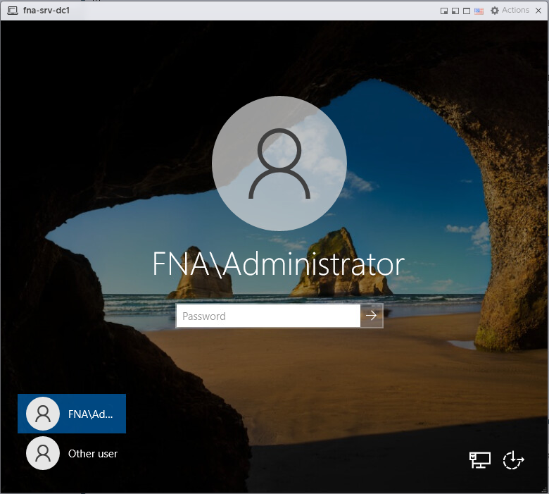

## What this proves

You built a **Windows Server 2022** VM, configured **static networking**, installed **AD DS + DNS**, and **promoted** the host to the first **Domain Controller** for `fna.test`.  
