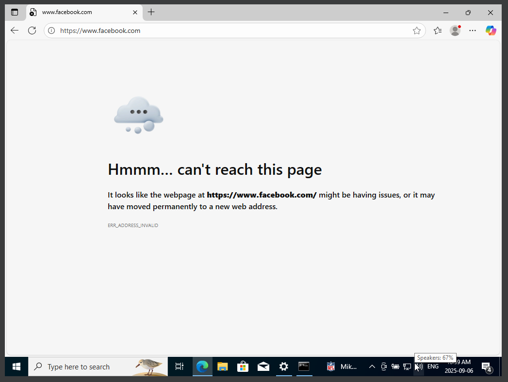
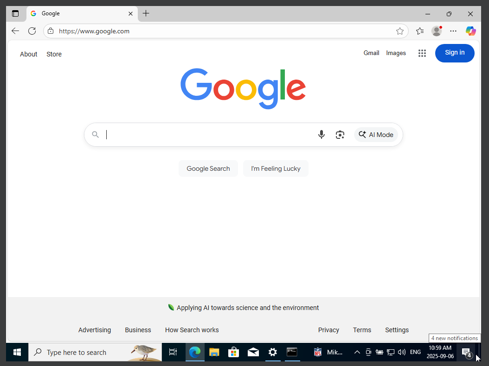

# Lab 2: Network Security & Access Control

## Project Summary
This lab simulates hardening a small office network in response to a phishing incident. Using a VirtualBox environment, I implemented layered security controls including SSH access restriction on Kali Linux, scoped RDP firewall rules on Windows Server 2022, DNS-based web filtering with sinkholing, and wireless network hardening policies. The project demonstrates practical skills in Linux firewalling, Windows firewall management, DNS administration, and secure Wi-Fi practices.

## Skills Practiced
- Linux firewall configuration (UFW)  
- SSH access restriction  
- Windows Defender Firewall rule scoping  
- DNS sinkholing for web filtering  
- Wireless network security best practices
---
## Scenario
A small office needs to be locked down after a phishing incident. I was asked to implement four preventative measures onto the network to prevent an attack like this from occurring in the future:

### 1. Harden SSH access to Kali Linux Security Workstation  
### 2. Restrict remote access to Server 2022 with firewall rules  
### 3. Configure DNS-based web filtering  
### 4. Secure wireless networking

---

## Network Topology
- **Windows Server 2022 (Infrastructure Server):** 192.168.10.10/24  
- **Kali Linux (Security Toolkit Workstation):** 192.168.10.11/24  
- **Windows 10 (IT Admin Workstation):** 192.168.10.12/24  
- **Default Gateway (Router):** 192.168.10.1/24  
- **DNS Server:** 9.9.9.9 (later changed to 192.168.10.10 when configured)

---

## Step 1: Harden SSH Access to Kali Linux Security Workstation

### 1. Verify Baseline Connectivity
Checked connectivity between all devices using `ping`:
- From Kali to Server & Admin Workstation  
- From Windows 10 to Server & Kali

### Echo request and reply confirmed connectivity between devices.


### 2. Install & Enable SSH
```bash
sudo apt update
sudo apt install openssh-server
sudo service ssh start
```

### 3. Install & Configure Firewall (UFW)
```bash
sudo apt install ufw
sudo ufw default deny incoming
sudo ufw default allow outgoing
```

### 4. Allow SSH Only from IT Admin Workstation (192.168.10.12)
```bash
sudo ufw allow from 192.168.10.12 to any port 22 proto tcp
```

### 5. Enable Firewall & Verify Ruleset
```bash
sudo ufw enable
sudo ufw status
```


### 6. Verify Connectivity from IT Admin PC
Used **PuTTY** from Windows 10 (192.168.10.12) to connect successfully.


### 7. Negative Test
Changed IT Admin PC IP to `192.168.10.13` leads to connection fail as expected.  
Reverted back to `192.168.10.12`.


### Harden SSH access complete.

---

## Step 2: Restrict Remote Access to Server 2022

### 1. Create Custom Firewall Rule
- Opened **Windows Defender Firewall with Advanced Security**.  
- Created a **new inbound rule**:
  - Port: **3389** (RDP)  
  - Protocol: **TCP**  
  - Action: **Allow the connection**  
  - Scope: **Restrict to remote IP 192.168.10.12 (IT Admin Workstation)**


### 2. Block All Other RDP Connections
- Verified that default “Remote Desktop” inbound rules were disabled.  
- Ensured only the custom rule allowing 192.168.10.12 remained active.


### 3. Validation
- From Windows 10 (192.168.10.12) - Successful RDP connection.  
- Changed IP to `192.168.10.13` - Connection failed as expected.


### Restricting remote access complete.

---

## Step 3: Configure DNS-Based Web Filtering

### 1. Install DNS Server Role
Installed the **DNS Server** role on Server 2022 and verified **DNS Manager** was available.


### 2. Create Sinkhole Zone
- In **Forward Lookup Zones**, created a **Primary Zone** named:
  ```
  facebook.com
  ```
- Added a new **Host (A) record**:
  - Name: `*` (wildcard)  
  - IP Address: `0.0.0.0`


### 3. Configure Forwarders
Added **Quad9 (9.9.9.9)** as a forwarder for all other lookups.


### 4. Update Client DNS Settings
- Pointed Windows 10 (192.168.10.12) to use **192.168.10.10** as its DNS server.  
- Flushed DNS cache:
```powershell
ipconfig /flushdns
```

### 5. Validation
- `nslookup facebook.com` - returned `0.0.0.0`  
- `nslookup google.com` - returned valid IP (forwarded via 9.9.9.9)  
- Browser test confirmed Facebook blocked, other sites accessible.





### DNS-based web filtering complete.

---

## Step 4: Secure Wireless Networking

### Scenario
In a real small office, attackers often exploit weak Wi-Fi settings. To prevent unauthorized access, wireless security must be hardened at the gateway (`192.168.10.1`).

### Actions Taken
- Enabled **WPA3-Personal** (or WPA2/WPA3 mixed mode for compatibility).  
- Ensured **AES encryption** was used.  
- Configured a **strong passphrase** (16+ characters, complexity enforced).  
- Disabled **WPS (Wi-Fi Protected Setup)**.  
- Enabled **guest Wi-Fi isolation** (optional).

### Validation
- Verified clients connected using WPA2/WPA3.  
- Confirmed WPS disabled in router settings.  
- Tested internet access remained functional.

### Wireless hardening complete.
