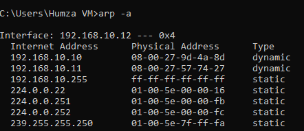

# Lab 3: Network Monitoring & Troubleshooting

## Project Summary
This lab focuses on validating network functionality and security configurations in a small office setup simulated in VirtualBox. Using monitoring and diagnostic tools such as Wireshark, Nmap, IP Scanner, and common network commands, I tested connectivity, scanned for devices and services, and verified firewall rules and DNS filtering put in place during earlier labs.

## Skills Practiced
- Network monitoring with Wireshark  
- Vulnerability and service scanning with Nmap  
- Subnet discovery using IP scanners  
- Troubleshooting with arp, ipconfig, netstat, nslookup, ping  
- Validating security controls (RDP restriction, DNS sinkhole)
  
## Scenario
Following the setup (Lab 1) and security hardening (Lab 2), the next step is ensuring the environment is functioning correctly while enforcing the intended restrictions. The goal of this lab is to perform **network monitoring and troubleshooting** using multiple tools and techniques.
  
## Network Topology
- **Windows Server 2022 (Infrastructure Server):** 192.168.10.10/24  
- **Kali Linux (Security Workstation):** 192.168.10.11/24  
- **Windows 10 (Admin Workstation):** 192.168.10.12/24  
- **Default Gateway (Router):** 192.168.10.1/24  

---

## Steps

### 1. Baseline Connectivity Check
Validated that all systems could communicate across the subnet before running scans.
```powershell
ping 192.168.10.10
ping 192.168.10.11
ping 192.168.10.12
```


---

### 2. Packet Capture with Wireshark (Windows 10 IT Admin Workstation)
- Ran Wireshark on IT Admin Workstation to capture RDP traffic.
- Verified that ICMP pings showed up in the capture.
- Confirmed RDP traffic from Windows 10 to Server 2022 appeared as TCP 3389 sessions.


---

### 3. Network Scanning with Nmap (Kali Linux)
- Scanned the subnet for active hosts and services.
```bash
nmap -sV 192.168.10.0/24
nmap -sV -p 3389 192.168.10.0/24
```
- Verified that only expected services (e.g., SSH on Kali, RDP on Server 2022) were visible.


---

### 4. IP Scanning with Windows 10
- Used an IP scanner tool to verify all live devices in the subnet.
- Cross-checked that the results matched the known topology (Server, Kali, Win10).


---

### 5. Troubleshooting with Commands
Validated connectivity, ARP resolution, active connections, and DNS lookups.

- **ARP:** View MAC-to-IP mappings  
  ```powershell
  arp -a
  ```


- **ipconfig:** Verify IP addressing and DNS server settings  
  ```powershell
  ipconfig /all
  ```


- **netstat:** Show active TCP sessions (should include RDP from Win10 to Server)  
  ```powershell
  netstat -n
  ```


- **nslookup:** Test DNS resolution against Server 2022  
  ```powershell
  nslookup facebook.com
  ```


- **ping:** Validate connectivity and blocked domains  
  ```powershell
  ping facebook.com
  ```

---

## Validation Results
- Connectivity confirmed between hosts (baseline pings).  
- Wireshark successfully captured ICMP and RDP traffic.  
- Nmap detected expected hosts and services only.  
- IP scanner verified network inventory.  
- Troubleshooting commands validated addressing, connections, and DNS sinkhole (facebook.com resolving to 0.0.0.0).
