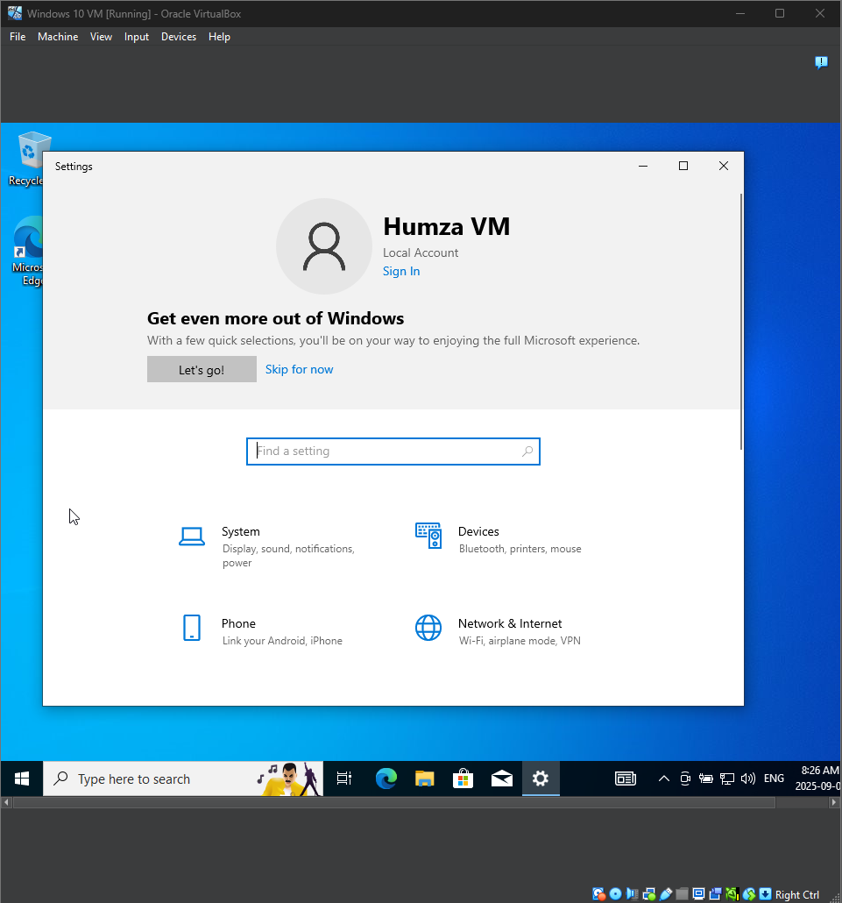
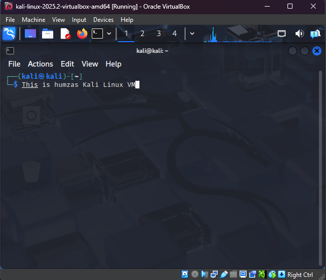
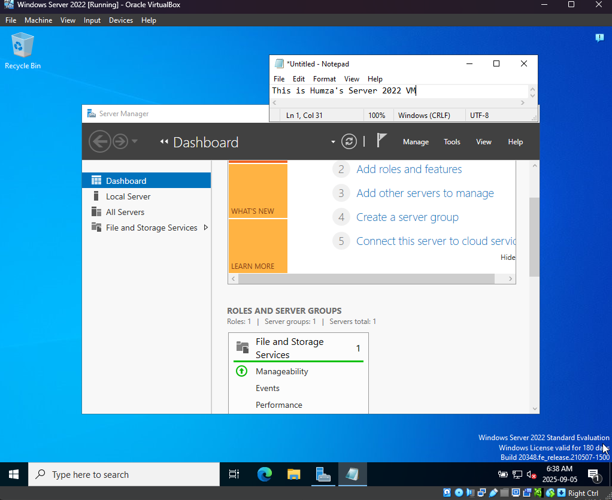

# Windows 10, Kali Linux and Windows Server 2022 VM Setup
**Skills Practiced:** Virtualization, OS deployment, user configuration, system administration

## Windows 10

### Steps

1. Created a new Windows 10 (64-bit) VM in Oracle VirtualBox and configured CPU, RAM, and storage.  
2. Mounted the Windows 10 ISO and booted into the installation wizard.  
3. Selected Windows 10 Pro, accepted license terms, and used default partitioning for installation.  
4. Completed the installation and verified the VM successfully booted into the Windows 10 desktop.  
5. Ran through the initial Windows configuration and created a user account for system access.

## Kali Linux

### Steps
1. Downloaded the pre-built VirtualBox image from the official Kali Linux website.  
2. Extracted the package and imported the VM into Oracle VirtualBox (blue Kali logo file).  
3. Adjusted CPU, RAM, and storage resources as needed for performance.  
4. Started the VM and logged in with the default credentials (`kali:kali`).  
5. Verified successful installation by accessing the Kali desktop environment and opening a terminal.

## Windows Server 2022

### Steps
1. Created a new Windows Server 2022 VM in Oracle VirtualBox and configured CPU, RAM, and storage.  
2. Mounted the Windows Server 2022 ISO and booted into the installation wizard.  
3. Selected Windows Server 2022 Standard (Desktop Experience), accepted license terms, and used default partitioning.  
4. Completed installation and verified the VM successfully booted into the Windows Server 2022 environment.   

